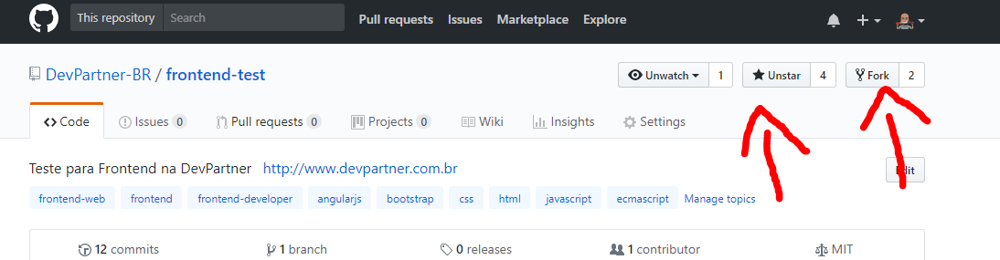

# | Frontend na DevPartner

## | Sobre a DevPartner

A relação de parceria estabelecida com o cliente é o ativo mais importante para a DevPartner. É o motor que leva a empresa a conhecer a fundo os negócios do cliente e, junto com ele, desenhar a melhor solução que atenda as suas necessidades.

"A nossa filosofia é a de viver o dia a dia do cliente, conhecer o seu negócio, estar ao seu lado e compreender as suas necessidades para ter a certeza de que vamos produzir o melhor resultado. Ser parceiro é isso!"  
 ***Eduardo Silvestri, Presidente da [DevPartner](http://devpartner.com.br/)***

## | Teste FrontEnd para o DevPartner
Essa teste consiste em entendermos um pouco mais sobre seus conhecimentos com [HTML](https://www.w3schools.com/tags/default.asp), [CSS](https://www.w3schools.com/cssref/default.asp),
[JavaScript](https://developer.mozilla.org/en-US/docs/Web/JavaScript/Language_Resources), Código responsivo, suporte a crossbrowser, [Angularjs](https://github.com/angular/angular.js) e lógica.

## | Orientações
Primeiramente, faça um fork e clone do projeto;
Crie uma branch com o seu nome e sobre nome e depois instale as dependências.   

**1. Dê um like e um Fork =)**



**2. Clone do Projeto**
```sh
git clone "https://github.com/**seu-usuario**/frontend-test.git"
```
*no lugar do "seu-usuario" coloque o seu usuário do github :)

**3. Criando nova Branch**
```sh
git checkout -b "meunomeEsobrenome"
```
**4. Instalando as dependências**

```sh
npm install
```

**5. Agora é rodar a aplicação**
```sh
npm start
```

***Observação:** fique a vontade para persisitir os dados no banco que for da sua preferência. Aqui usamos MS-SQL e similares mas também curtimos NOSQL*

A sua primeira interação será com a página de Login, para facilitar deixamos padrão usuário **admin** e senha **admin**.

### Depois do setup você precisará seguir as seguintes instruções, para construir a aplicação:

1. Desenvolver a página - contamos com a sua criatividade e senso de coerência.
2. Criar um JavaScript usando o Angularjs que faça o CRUD (Create, Read, Update and Delete) utilizando como fonte o arquivo **/galeria.json** localizado em **/devpartner/Devpartner-PortalAdmin/data**.
  * Apresentar os dados do arquivo json nas telas de **index**, **create** e **edit**.
3.  **NÃO** alterar o arquivo **galeria.json**. Em hipótese nenhuma!
4. Se for preciso modificar a estrutura e workflow, atualizar o README.
5. Submeta o Pull Request e envie um email para **fabiana.carvalhal@devpartner.com.br e samara.freitas@devpartner.com.br** :D

O que acontece depois ?
Avaliaremos a sua **Pull Request** e se estiver atendendo os requisitos obrigatórios, marcaremos uma apresentação do exercício, afinal de contas, ninguém melhor que o próprio desenvolvedor para explicar o seu projeto =)
*fique tranquilo já passamos por isso também*

## | Requisitos obrigatórios
1. Escrever o código com Angularjs  ;)
2. Semântica Web 
3. CRUD funcionando!
4. Suporte para IE11 e multiplataforma (crossbrowser web / mobile - Responsivo).
5. Procure manter a estrutura do projeto.

## | Requisitos extras 
1. Automação de tarefas. (Gulp? Grunt? Webpack? :D)
2. Documentação
3. Testes automatizados
4. Template Engines (underscore, mustache, ou outras de sua preferência)
5. Performance

## | Quer impressionar ?
1. Melhore nosso projeto base para testes de front-end (*melhorias relevantes, por favor*)
2. Demonstre domínio na stack proposta (**menos *import modules*** e **mais domínio da stack**)

## | Ferramenta de Desenvolvimento

Fique a vontade para usar a ferramenta mais confortável para você ;)   
Aqui usamos muito o [Visual Studio](https://www.visualstudio.com/) e [VS Code](https://code.visualstudio.com/).


<sub>Os dados presentes neste teste são totalmente fictícios.</sub>
